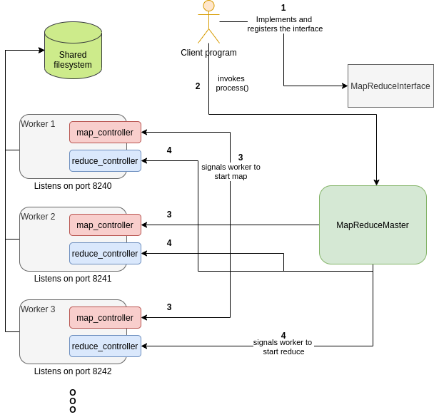
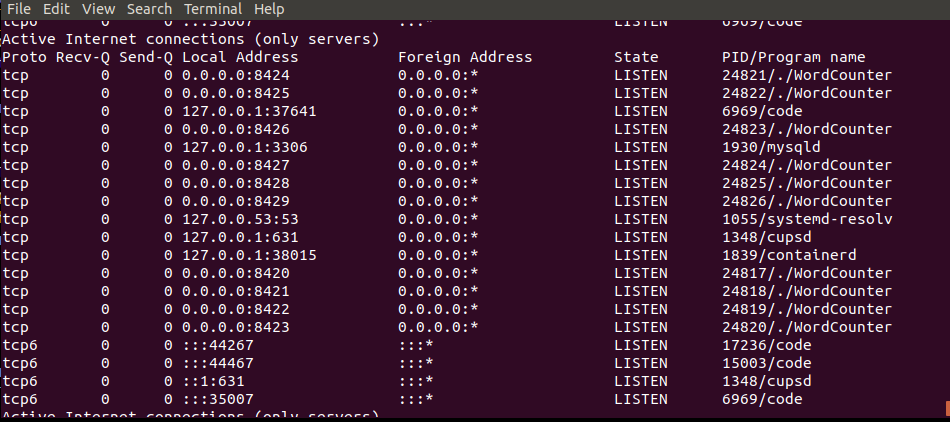

# MapReduceCpp
MapReduceCpp is a distributed multi-threaded multi-process fault tolerant implementation of Map-reduce system.
Implementation is done completely in C++. Three sample map-reduce program is also implemented.

This project is a part of course COMPSCI 532: Systems for data science.
On October 31st 2020, we are making this project public.

### Requirements
* C++17 or better.
* CMake 3.15 or better.

### Script to automatically build and run sample programs.
`sh script.sh`

Running this command builds the `libMapReduceCpp.so` library, builds three sample program namely `WordCounter`, `InvertedIndex` and `ReverseWeblinkGaph` (and links the library to these programs). All the builds are placed in a directory `build` (will be created automatically). The output of the three programs are also placed in the `build` director (WordCounter_output.txt, InvertedIndex_output.txt and ReverseWeblinkGraph_output.txt).

## Project details

### Implementation
The MapReduceCpp is a header only library. The source code for the library can be found in `include` directory. `include/MapReduceMaster.h` is the entry point to use this library. This header file when included into a program, provided the access to an object `MapReduceMaster` and an API `process()` to start the processing. Clients are also required to implement MapReduceInterface and register the user-defined map and reduce function. For APIs, please refer the sample below:

```C++

#include "MapReduceMaster.h"

class MyAwesomeMapReduce : MapReduceInterface {
    void map_fn(string key, string value) {
        // Your map function implementation here
        // Dont forget to call emitIntermediate() on each key-value pair after mapping
    }

    void reduce_fn(string key, vector<string> value_list) {
        // Your reduce function implementation here
        // Dont forget to call emit() on each key-value_list pair after reduction
    }
}

// Now register your awesome map reduce implementation
MapReduceInterfaceFactoryRegistration<MyAwesomeMapReduce> _MyAwesomeMapReduce("MapReduce");

int main() {
    MapReduceMaster masterObj("inputFileName.txt", "dataDirectory", Number_of_worker);
    int status = masterObj.process();
    return 0;
}

```

Please check sample implementation of WordCounter in the file `src/WordCounter.cpp`, InvertedIndex in the file `src/invertedIndex.cpp` and ReverseWeblinkGraph in the file `src/ReverseWeblinkGraph.cpp` for more details.

### High-level design
A high level design of the library is shown below:


The interaction diagram is shown below:


The program uses N servers on different process. WordCounter was run on 10 servers.
The `sudo netstat -ltnp` terminal output is shown in the below snapshot:


### Fault tolerance upto one server failure
To test the fault tolerance of map and reduce operations (upto one failure), below steps were following:
1. Added pseudo work load (by adding sleep for 5 to 10 seconds) on the map and reduce workers.
2. Started the WordCounter Program on two servers.
3. Started tracking the process id for each ports (using command `netstat -nltp -c`)
4. Randomly killed (using `kill -9 PID`) a map process listening on one of the ports.
5. Randomly killed (using `kill -9 PID`) a reduce process listening on one of the ports.

The result was:
MapReduce library successfully recovered the failed server by detecting the server fail using heart-beat mechanism
and started a new server listening on the old port. Following this, the map reduce library also
called the map (or else reduce) task on the newly started server.

A snapshot of the experiment is shown below:


### Project Structure
`docs` Contains documentation related to the project, how to build the project and other pointers relevant to C++ programming.

`include` Contains header files of the MapReduceCpp library.

`src` Contains the source file of the programs that uses MapReduceCpp library.

`test` Contains unittests, uses googletest

`lib` Extra libraries on which the project depends on, these comes along with the package.

`extra` Contains source code to test new ideas, concepts and design.

`build` Automatically generated on building the project. Contains the intermediate compiled files and the compiled MapReduceCpp library.

`spark` Contains the respective Spark codes for the three applications to check the correctness of our MapReduce implementation. Output is written to /build/WordCount_SparkOutput.txt, /build/InvertedIndex_SparkOutput.txt, and /build/ReverseWeblinkGraph_SparkOutput.txt. Need Spark installed.

## Project Implementation
Refer the Documentation in the `docs` folder for more details. See the inline comments in the MapReduceMaster.h file for more implementation details.
