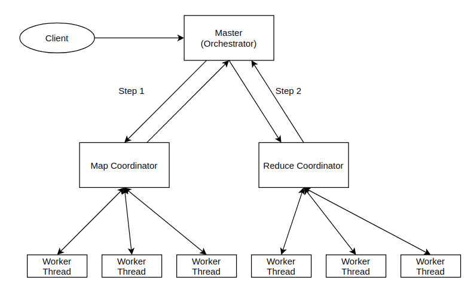

# MapReduceCpp
An implementation of multithreaded version of MapReduce that simulates the fault tolerance on a single machine.

## For the purpose of project evaluation, please follow the step-by-step guidlines
### Requirements
* Since the the project is implemented in C++, you should have atleast C++17 installed on your system.
* Since the project uses CMake to build the project (the MapReduce library and three use-case programs), CMake >= 3.15 should be installed on your system.
### Script to automatically build and run sample programs.
`sh script.sh`

Running this command builds the `libMapReduceCpp.so` library, builds three sample program namely `WordCounter`, `InvertedIndex` and `ReverseWeblinkGaph` (and links the library to these programs). All the builds are placed in a directory `build` (will be created automatically). The output of the three programs are also placed in the `build` director (WordCounter_output.txt, InvertedIndex_output.txt and ReverseWeblinkGraph_output.txt). Please check the corresponding inputs to these program in the `data` directory.

## Project details

### Implementation
The MapReduceCpp is a header only library. The source code for the library can be found in `include` directory. Most importantly, `include/MapReduceMaster.h` is the entry point to use this library. This header file when included into a program, provided the access to an object `MapReduceMaster` and an API `process()` to start the processing. Refer below the pseudo program to understand the API.

```C++

#include "MapReduceMaster.h"

vector<pair<key2, value2>> map_function(key1, value1) {
    // Your map function implementation here
}

vector<value3> reduce_function(key2, vector<value2>) {
    // Your reduce function implementation here
}

int main() {
    MapReduceMaster<key1, value1, key2, value2, value3> masterObj;
    int status = masterObj.process(inputFile, outputFile, map_function, reduce_function, nr_mapper, nr_reducer);
    if (status == 0) {
        cout << "MapReduce completed" << endl;
    }
    return 0;
}

```

Notice that typename `key1`, `value1`, `key2`, `value2` and `value3`. These are defined by the user of MapReduce library and depends on your signature of map and reduce function definition.

Please check sample implementation of WordCounter in the file `src/WordCounter.cpp`, InvertedIndex in the file `src/invertedIndex.cpp` and ReverseWeblinkGraph in the file `src/ReverseWeblinkGraph.cpp` for more details.

### High-level design
A high level design of the library is shown below:



### Project Structure
`doc` Contains documentation related to the project, how to build the project and other pointers relevant to C++ programming.

`include` Contains header files of the MapReduceCpp library.

`src` Contains the source file of the programs that uses MapReduceCpp library.

`test` Contains unittests, uses googletest

`lib` Extra libraries on which the project depends on, these comes along with the package.

`extra` Contains source code to test new ideas, concepts and design.

`build` Automatically generated on building the project. Contains the intermediate compiled files and the compiled MapReduceCpp library.

## Project Implementation

### Master
Master is implemented by MapReduceMaster class, which initializes with the input file name, output file name, map function pointer, reduce function pointer, and number of worker threads. On calling the process function, it creates the several workers for map, waits for each of the thread to return a success signal, then creates and lanches workers for reduce. Once all threads are returned, the master returns with a success signal.

The client program can invoke the process in a seperate thread without blocking, however, this is optional.

### Mapper
Mapper is a logical entity, which is implemented in the process() method of the MapReduceMaster class.

### Reducer
Reducer is a logical entity, which is implemented in the process() method of the MapReduceMaster class.

### Workers
TODO

## Contributors:
Jessie Huo

Vishal Keshav

Kenneth Myers